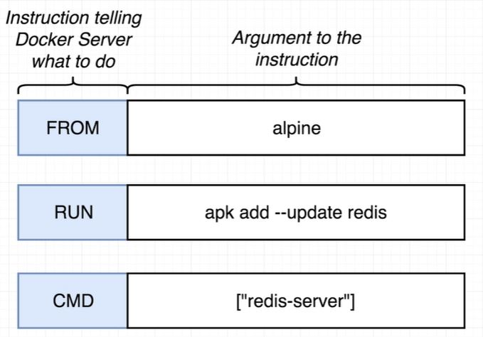

## Docker Commands

### Overview:
This page explains how to create docker custome image.

### Dockerfile

Dockerfile is use to create docker custom image. 



Here is sample Dockerfil, - 

```markdown
#Use an existing docker image as base image
FROM alpine

#Download and install dependecny
RUN apk add --update redis

#Tell the image what to do when it starts the container
CMD ["redis-server"]
```

<br/><br/>
[<i class="fa fa-arrow-left"></i> **Back**](/docker-documentation/)
